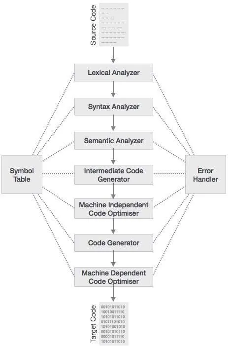

# Lab 1: Deconstructing the C Compilation Pipeline

---

## 1. Objective

The objective of this lab is to analyze and understand the transformation of a C source file into an executable program by examining each phase of the GCC compilation pipeline. The lab focuses on isolating and observing the outputs of preprocessing, compilation, assembly, and linking stages.

---

## 2. Technical Theory

The process of converting a C program into an executable file involves multiple stages, each handled by a specific component of the GCC toolchain. These stages ensure that high-level human-readable code is converted into machine-executable instructions.


### 2.1 Preprocessor (cpp)
The preprocessor handles all preprocessing directives. It performs the following tasks:
- Expands `#include` directives by inserting header file contents
- Replaces `#define` macros with their defined values
- Removes comments from the code

The output of this stage is an expanded source file.

---

### 2.2 Compiler (cc1)
The compiler translates preprocessed C code into assembly language. It performs:
- Syntax analysis
- Semantic analysis
- Code optimization

The output is a `.s` file containing assembly instructions.

---

### 2.3 Assembler (as)
The assembler converts assembly language into machine-level object code.

- Output file: `.o` (object file)
- This file contains binary instructions and is not human-readable

---

### 2.4 Linker (ld)
The linker combines object files with libraries to generate a final executable.

- Resolves external references (e.g., `printf`)
- Produces a runnable program

---

## 3. Lab Environment

- **Operating System:** Linux / Windows (MinGW)
- **Compiler:** GCC (GNU Compiler Collection)
- **Editor:** Visual Studio Code

---

## 4. Procedure and Manual Tracing

### Step 1: Create Source Code

Create a file named `lab1.c` and write the following program:

```c
#include <stdio.h>

int main() {
    int a, b, sum;

    printf("Enter two numbers: ");
    scanf("%d %d", &a, &b);

    sum = a + b;

    printf("Sum = %d\n", sum);

    return 0;
}
```


## Step 2: Isolating Compilation Phases

The GCC compilation process consists of multiple stages. The following steps demonstrate how each stage can be isolated and analyzed individually.

---

## 🔁 GCC Compilation Pipeline Diagram


---

### A. Preprocessing

**Command:**
```bash
gcc -E lab1.c -o lab1.i
```

### Observation:

The #include <stdio.h> is expanded into a large block of code
Macros (#define) are replaced with their actual values
All comments are removed
Output file: lab1.i (expanded source code)
B. Compilation (Assembly Generation)

### Command:
```bash
gcc -S lab1.c -o lab1.s
```
### Observation:

Produces assembly language code
Contains instructions like mov, add, etc.
Platform-dependent output
Output file: lab1.s
C. Assembly (Object Code Generation)

### Command:
```bash
gcc -c lab1.c -o lab1.o
```
### Observation:

Generates machine-level object code
File is in binary format (not human-readable)
Output file: lab1.o

### Advanced Observation:

nm lab1.o
Displays symbol table
Shows defined symbols like main
Shows undefined references like printf
D. Linking

### Command:
```bash
gcc lab1.o -o lab1
```
### Run the Program:
```bash
./lab1
```
### Observation:

Object file is linked with standard libraries
External references (e.g., printf) are resolved
Final executable is created and runs successfully

---

## 📁 What you must do now (important)

1. Create an **images folder**
```bash
mkdir images
```